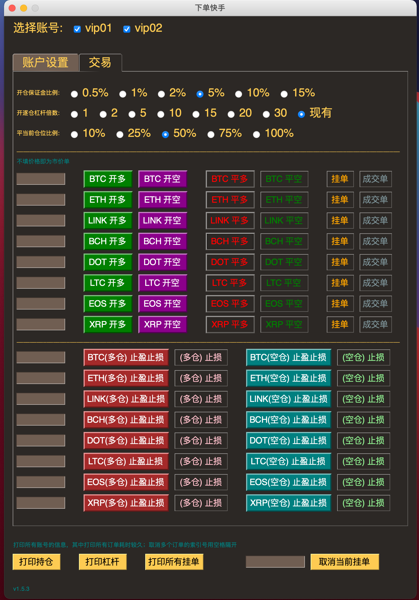
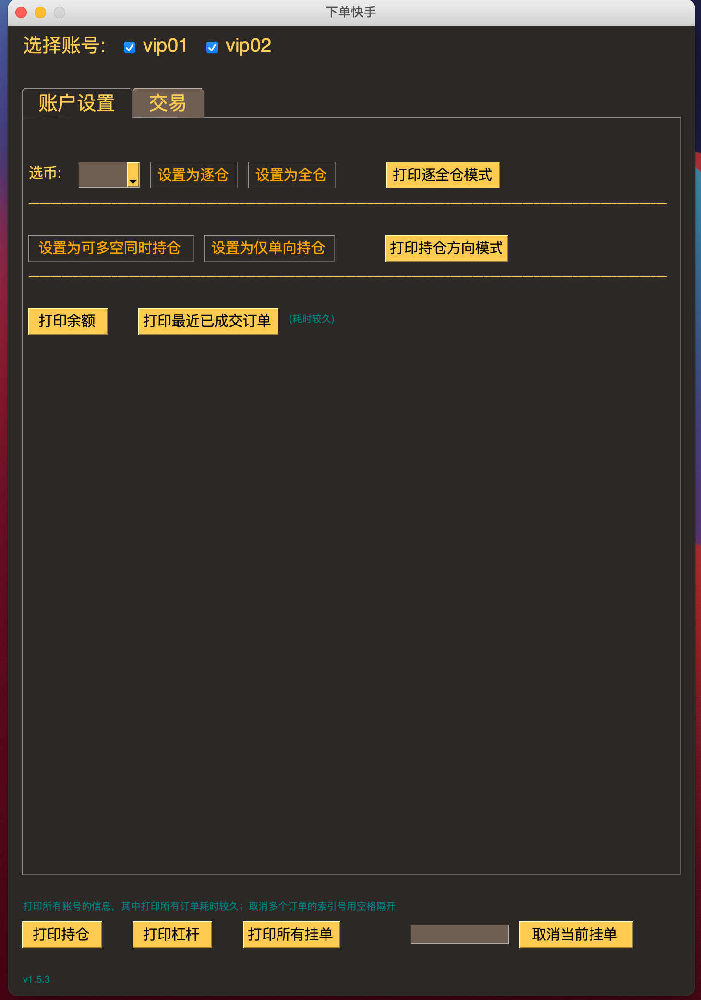

## 开源一个基于 Python 的多账户下单小工具

之前跟做日内交易的朋友合作开发了一些基于形态的交易信号，其中涉及到要给多个账号手动下单的情况，而且还要求多个币种。交易所自带的下单功能和市面上的现有软件都不太符合要求，有的是必须要软件一直在线单子才在，软件断线了、关机了，你的计划单子就不会发出去，可能单子并没有下到交易所，或者被他们服务器端程序取消了，不得而知；要不就是账号之间切换起来太慢，币种切换麻烦，总之如果是手工下单的话，多账号多币种操作起来非常繁琐, 而日内交易又对下单速度要求较高。于是问我看看有没有办法解决。我看了一下如果只做一个交易所的话，而且只做永续合约一种，工作量不算太大，于是就搞了一个。

因为这个下单软件不涉及交易策略，所以干脆共享出来，也许对于有同样需求的人有帮助。不过，我们最后没有使用这个版本，所以代码的完成度并不是100%，不过也达到98%左右了吧。功能简单，代码您随便看看，我觉得主要是思路可能有帮助。没有使用主要是因为需要科学上网的原因，科学上网了看盘就慢了，这个对于做日内的很致命，所以后来使用了另外一套解决方案，更兼容不同的操作系统使用，代码升级也方便。以后再说了。

这个 Gui 就是基于 Python 的 [PySimpleGUI](https://link.zhihu.com/?target=https%3A//github.com/PySimpleGUI/PySimpleGUI)，或者[这个文档](https://link.zhihu.com/?target=https%3A//pysimplegui.readthedocs.io/en/latest/)了解。

 
&nbsp;&nbsp;&nbsp;&nbsp;&nbsp;&nbsp;&nbsp;&nbsp;&nbsp;&nbsp;&nbsp;&nbsp;&nbsp;&nbsp;&nbsp;&nbsp; 

这个 PySimpleGUI 非常简单实用，但是对于有的版本的 Python 可能有问题，例如苹果电脑自带的 Python3 就因为 tinker 版本太老用不了，当然你可以自己安装解决。还有遇到的一个问题就是鼠标的 focus 有的时候不知道跑哪里去了，需要用户去点一下别的软件或桌面。当然这都是在 Mac 上的问题，估计 Windows 上的可能也会有。现在要想做一个兼容性高且好用的客户端还得用 electron，不过得使用 JavaScript 等编程语言，对于做量化的来说可能会的不多。

下面是这个工具的交易主界面（随便取了一个名字-下单快手😂）。这里面的币种可以通过配置文件修改，不用怎么改动代码，开关仓位的资金比例，杠杆等设置也可以根据交易员习惯预先设置好。很多都是逐仓下 10% 保证金，然后20倍杠杆这么玩。一些小tips,比如不输入价格就是市价，取消单子是按照打印输出的挂单序号等。

-----

Only work for Binance Swap for now

Suit for multi accounts and multi symbols management and quick open/close positions

To run this app: 
    Python3 ui.py

    of course you have to have the necessary packages installed in the env

    and fill your own apiKeys/secrects in the utils/acct.csv

You might need VPN to run this program if you are behind the GFW

More info on https://zhuanlan.zhihu.com/p/336938263 in Chinese

MIT License
...